<p align="center">
  <br>
  <b>Legrand with Netatmo (Local)</b> — Homey Pro app<br>
  <sub>Local control of Legrand with Netatmo and BTicino devices over the HomeKit Accessory Protocol. No cloud.</sub>
</p>

<p align="center">
  <a href="CHANGELOG.md">Changelog</a> ·
  <a href="#installation">Installation</a> ·
  <a href="#devices">Devices</a> ·
  <a href="#flows">Flows</a> ·
  <a href="#dashboard-widgets">Widgets</a> ·
  <a href="#heating-plan">Heating plan</a> ·
  <a href="#scenes">Scenes</a> ·
  <a href="#troubleshooting">Troubleshooting</a>
</p>

---

**Version 0.12.0 (beta)** · GPL-3.0 · requires Homey Pro (2023 or later), firmware ≥ 12.4.0

## What it does

The Legrand gateway (Home + Control) and the BTicino Smarther thermostats are HomeKit
accessories. This app pairs with them directly on your LAN — the way an iPhone would — and
turns them into native Homey devices: lights, shutters with slat tilt, wireless remotes and
thermostats. Everything stays local: no Legrand cloud, no Apple Home, no internet needed.

On top of the devices it adds **scenes**, a **house-wide heating plan** with per-room
temperatures, and **dashboard widgets**.

> The Home + Control app keeps working as before (it talks to the devices over Legrand's own
> channel). Only the HomeKit pairing moves to Homey — a HomeKit accessory accepts a single
> controller, so devices paired here must not be in Apple Home at the same time.

## Installation

1. Install the app (from the App Store once published, or `homey app install` from this repo).
2. **Add a device** → Legrand → any device type. The wizard lists Legrand / BTicino HomeKit
   devices found on your network; select the gateway and enter its 8-digit HomeKit setup code
   (on the gateway's label or in Home + Control → gateway → HomeKit).
3. Tick the devices to add. Repeat per device type; pairing happens only once.
4. Smarther thermostats are separate HomeKit accessories: pair each one with its own code
   (App settings → Gateways → Found on the network → Pair, or the wizard).

If Homey can't see a device via mDNS (different VLANs), pair it by HomeKit id + IP address
(App settings → Gateways → Expert). Give the gateway and thermostats DHCP reservations.

## Devices

| Driver | HomeKit service | Capabilities |
|---|---|---|
| **Light** | Lightbulb | `onoff`, `dim` (dimmers), `light_hue` / `light_saturation` / `light_temperature` (colour bulbs) — all added automatically. Energy approximation 8 W (editable). |
| **Shutter** | Window Covering | `windowcoverings_set` (position), `shutter_tilt` (slat angle in degrees, only on shutters in *Orientable sun shades* mode), `shutter_moving`, `shutter_status` (tile text, e.g. `56 % · 44° ▲`) |
| **Wireless remote** | Stateless Programmable Switch + Battery | `alarm_battery` + button-press Flow trigger |
| **Smarther thermostat** | Heater Cooler (or Thermostat) + Humidity Sensor | `measure_temperature`, `target_temperature` (5–30 °C, 0.5 steps), `thermostat_heating`, `thermostat_mode` (Schedule / Manual / Frost guard / Off), `measure_humidity`, `thermostat_status` |
| **Socket / contactor** *(experimental)* | Outlet / Switch | `onoff` — connected sockets, contactors, teleruptors, cable outlets |
| **Sensor** *(experimental)* | Contact / Motion / Smoke / CO Sensor + Battery | `alarm_contact` / `alarm_motion` / `alarm_smoke` / `alarm_co`, `alarm_battery`, `alarm_tamper` |

### Support status

| Status | What it means | Devices |
|---|---|---|
| ✅ **Verified** | Tested on real hardware by the author | Light switches (single/double), dimmers, roller shutters (aperture and orientable modes), wireless 2-button remotes, Smarther with Netatmo thermostat, the Legrand gateway itself · **Somfy TaHoma Switch** as a second HomeKit bridge with an io awning (extended/retracted, invert direction, awning look) |
| 🧪 **Experimental — likely** | Implemented from the HomeKit specification; Legrand documents these as HomeKit-compatible but they have not been seen on hardware yet | Sockets, contactors, teleruptors, cable outlets (Legrand lists all "with Netatmo" outlets as HomeKit devices) · colour / tunable-white third-party bulbs · Netatmo smoke and CO alarms (standalone HomeKit accessories, paired like a Smarther) · thermostats exposing the standard Thermostat service |
| 🧪 **Experimental — uncertain** | Code exists, exposure over HomeKit not confirmed | Wireless motion sensor (a gateway accessory in Legrand's US range) |
| ❌ **Not possible** | Not exposed over HomeKit by Legrand/Netatmo | Netatmo door/window sensors (they pair with Netatmo cameras, cloud only), Netatmo modulating thermostat and radiator valves, energy meter / load shedder, BTicino alarm system, sirens, Home + Control scenes, schedules and Boost |

Have an experimental device? Its dump from the app settings (Devices tab → status) or a log excerpt is all that's needed to promote it to verified — please open an issue.

### Other HomeKit gateways

The app is a generic HAP-over-IP controller: the Gateways tab discovers **every** HomeKit device on the
network, and a paired bridge's **"Devices…"** button previews what it exposes before anything is added —
name, manufacturer · model, and which driver each item would use ("not supported yet" items log their raw
HAP services so support can be added). First non-Legrand bridge verified: the **Somfy TaHoma Switch**
(io devices only — Somfy does not expose RTS over HomeKit). Candidates worth trying: Velux Active,
Lutron Caséta, Aqara hubs, Bosch SHC. Pairing quirks are narrated end-to-end in the Log
(advertisement refresh → TCP pre-flight → pairing method → verdict); the log survives restarts and
updates, with a Clear button and a "wipe on restart" toggle for clean debug sessions.

### Pairing icons

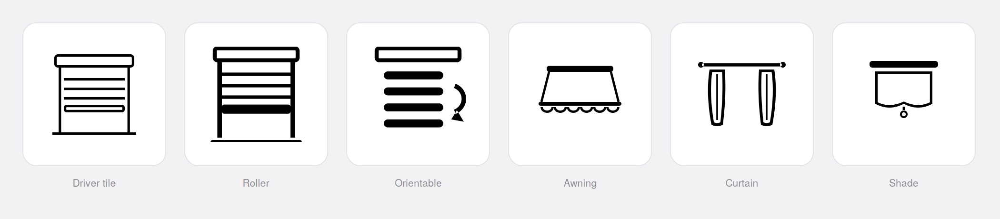

Devices pair pre-dressed when the gateway tells us enough: slat tilt → orientable icon; models matching
*awning/pergola* → awning icon, **sunshade** class and the Awning look; *curtain/glydea/rideau* → curtain
icon, curtain class and the split-curtain look; *screen/rollershade* → shade icon and look. Everything
else gets the roller default (Homey freezes the tile icon at pair time; the "Drawn as" look can always
be changed later).

All devices: **Blink** (identify the wall module) and **Rebuild device capabilities**
maintenance actions in Advanced settings. Devices are identified by serial number, so they
survive re-pairing the gateway, and their capabilities follow configuration changes made in
Home + Control (e.g. a shutter switched to orientable mode gains its tilt control automatically).

Slat tilt on Legrand orientable shutters has five positions (0 / 22 / 44 / 66 / 88°); the tilt
slider snaps to them.

## Flows

**Triggers**
- Remote: *Button [1–8] is pressed ([any | single | double | long])* — token: press type
- Thermostat: *Heating started / stopped*
- Heating plan: *Heating profile changed* (tokens: profile, previous profile)
- plus Homey's built-in cards for every standard capability (turned on/off, dim level, position, state up/down, temperature, target, mode, humidity, colour…)

**Conditions**
- Shutter *is / isn't moving*
- Thermostat *is / isn't heating*
- Heating profile *is / isn't [Comfort | Eco | Night | Away | Frost guard]*

**Actions**
- Shutter: *Set slats to [angle]* · *Set position to [x %] and slats to [angle]* (moves first, tilts once stopped)
- *Activate scene [scene]*
- Heating: *Set heating to [profile] [until next switch | 1 h | 2 h | 4 h | 8 h | 24 h | until cancelled]* · *Resume heating plan*
- Thermostat mode → Frost guard / Schedule / Manual / Off via the standard *Set thermostat mode* card

## Dashboard widgets

Five widgets for Homey Dashboards, each configurable per instance (which devices or scenes). Shutters, Heating and Scenes work with this app's devices; **Lights** and **Climate** work with any light or thermostat on Homey.

#### Shutters

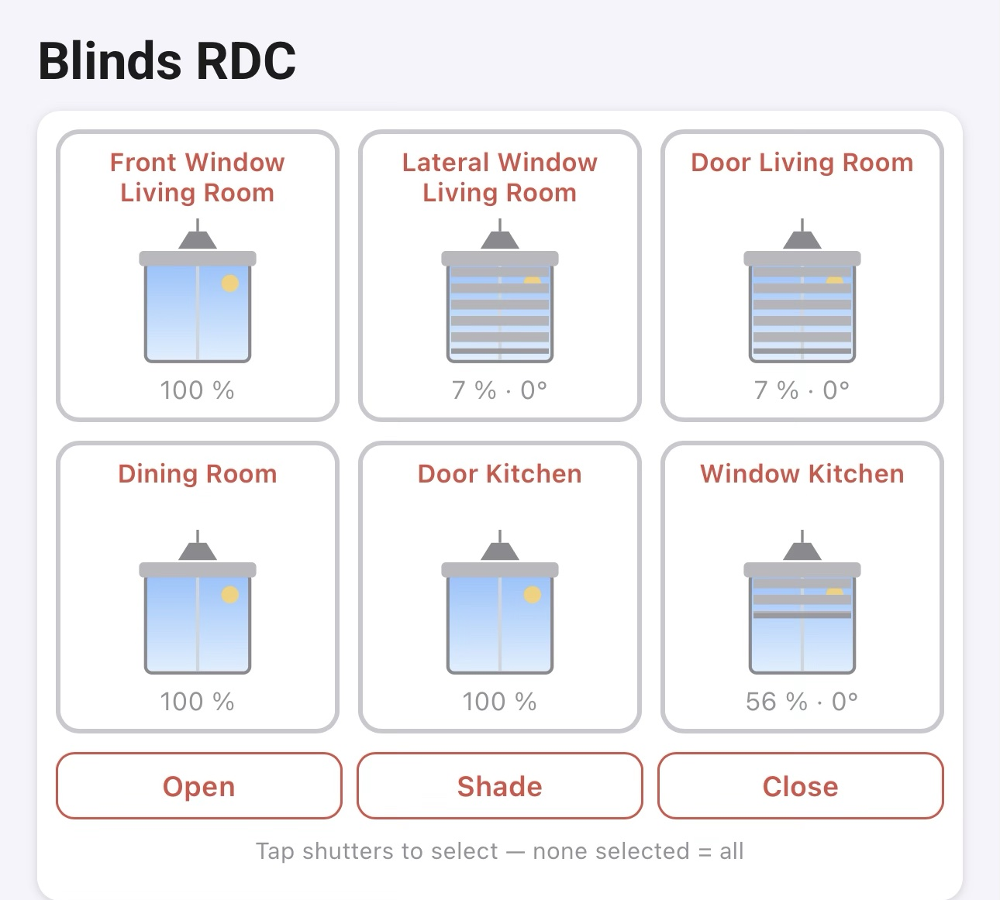

Live-drawn windows, grouped in a bordered box per room (name top-left, a pendant top-right that lights when a
lamp in that room is on; an "individual" flat layout is available). The sky follows the time of day **and the
weather** — clouds, falling rain or snow from Open-Meteo at Homey's location, sun on clear days, the moon on
every night sky with the clouds passing in front. Tap windows or a room name to select, then
**Open / Shade / Close** (relabelled **Retract / Half / Extend** when the widget shows only awnings). Pressing
the direction a shutter is already moving in *stops* it, like the physical rocker — the position is estimated
from the learned travel speed. A "Cards per row" setting (3 / 2 / 1) scales the drawings up to a full-width
card — name and value in the left third, the façade in the remaining two — with line weights kept constant.

##### Covering looks

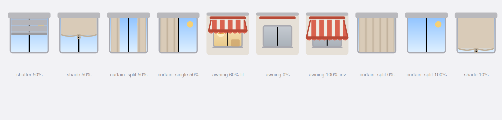

Every device has a **"Drawn as"** setting: **Roller shutter** (default, slats + tilt), **Roller shade** (fabric,
curved hem, pull ring), **Curtain — split** (two panels closing from the sides), **Curtain — single**, and
**Awning**. Position stays 0–100 % for every look; only the drawing changes. Models that announce themselves
pair pre-dressed (see *Pairing icons* below).

##### Awnings — seen from outside

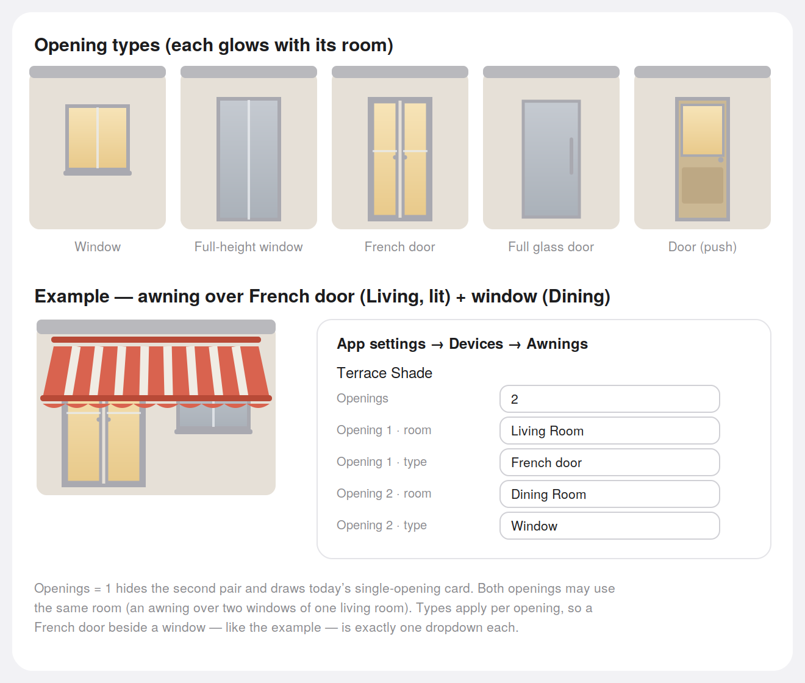
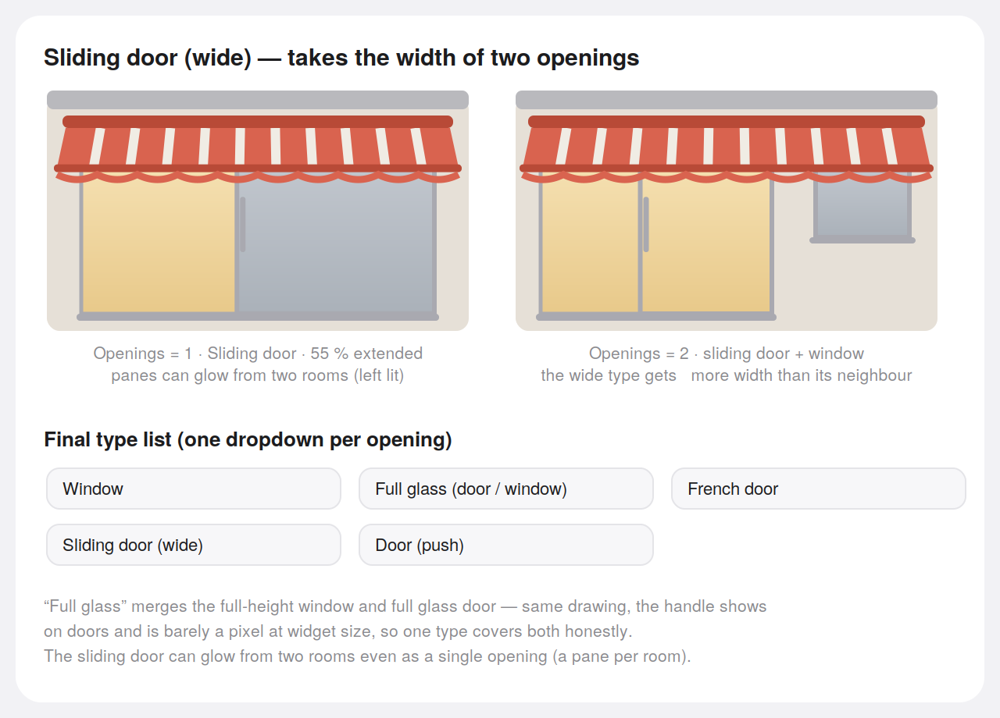

The awning card flips the vantage point: wall around the glass, the **interior** behind it — warm when the
room's light is on, dark at night. Configure per awning in App settings → Devices → **Awnings**: 1 or 2
openings, each with its own interior room (the awning may live in *Terrace* while *Living Room* lights its
window) and an opening type — **Window · Full glass (opens from inside, no exterior handle) · French door ·
Sliding door (wide, its two panes can glow from two rooms) · Door (push)**. An **invert direction** device
setting handles gateways that report awnings mirrored (Somfy io does — their own app ships three invert
toggles; here one switch at the device boundary covers position, direction and presets at once).

##### Weather, dark mode, calibration

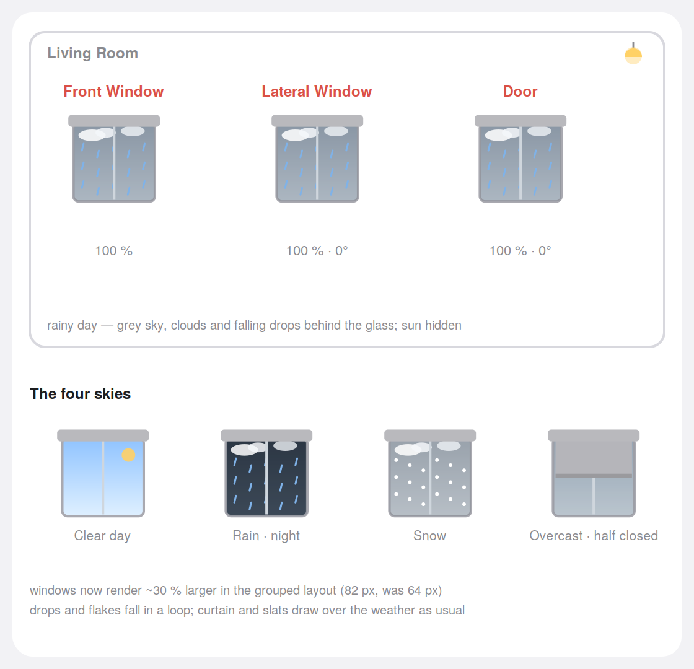
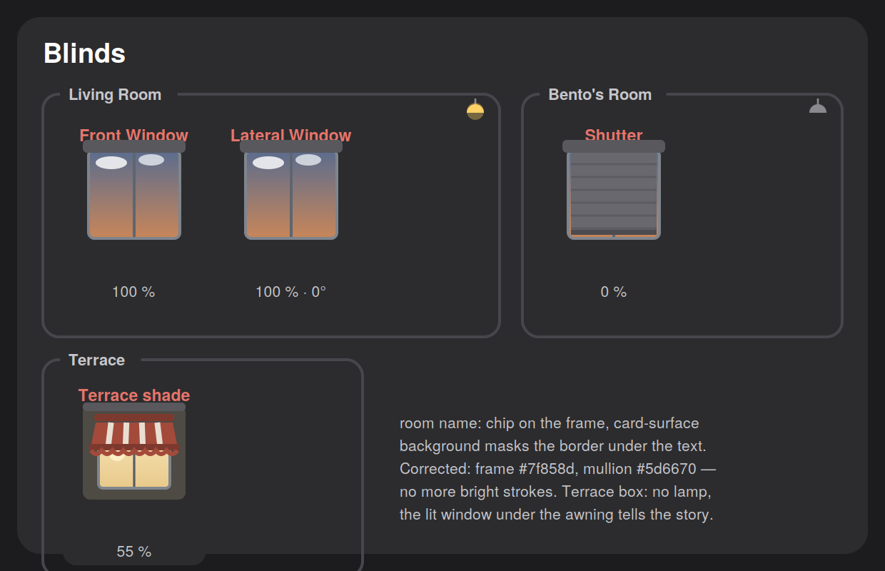
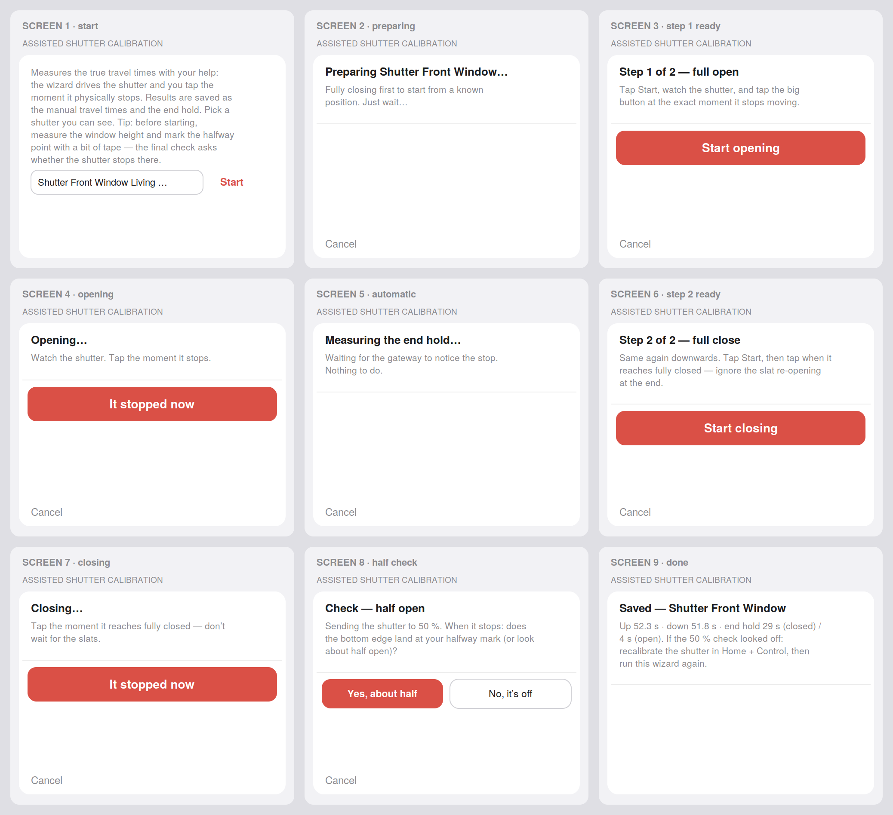

Animation runs at each shutter's learned travel speed; the **Assisted calibration** wizard
(App settings → Devices) measures true travel and the gateway's end-hold with your help — you tap the moment
the shutter physically stops — and a maintenance button offers a fully automatic variant. All drawing chrome
is theme-aware; dark mode gets muted frames, mullions and fabric.

#### Heating

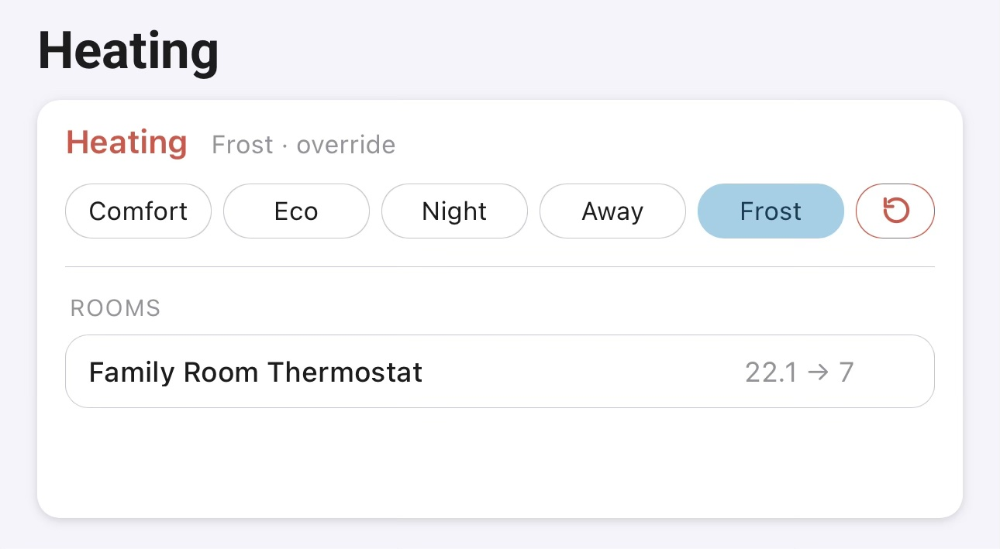

Current profile and next switch, profile chips to override, a resume-schedule button, and one card per room
with temperature → target, a flame while heating and manual/off tags.

#### Lights *(any Homey light)*

Tiles, room cards, or **room scenes** — a side view of the room with furniture inferred from the room's name
(kitchen counters, sofa and TV, beds, desks…) and each lamp drawn into place by type, anchored to matching
furniture (hob spot over the cooktop, pendant over the table). Tap a lamp to toggle, hold for its panel. Each lamp is drawn by type — ceiling, floor lamp, table lamp, bulb, LED strip, spot, wall switch, wall light, outdoor — in the colour
and brightness it currently emits (Hue colours, tunable whites, plain switches). Tap to toggle, "All off" per widget or
per room, and the room's Homey moods as buttons. Lamp types are guessed from names and editable in App settings → Lights.

#### Climate *(new — any Homey thermostat, including air conditioners)*

Gauge room cards that adapt to the device: Smarther rooms get ± setpoint, profile chips (Comfort / Eco / Night) and
"Plan"; air conditioners get their modes, fan speed, swing / eco / boost toggles and the outside temperature. Tints:
warm while heating, cool while cooling, grey when off. A compact list layout is available.

#### Scenes

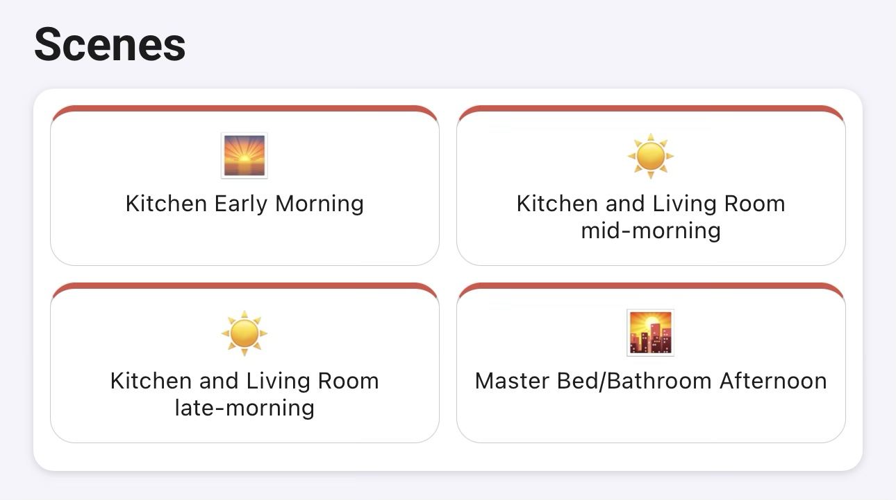

Tiles with the scene's emoji; tap to run. Show all scenes or pick up to six.

#### How to read a window

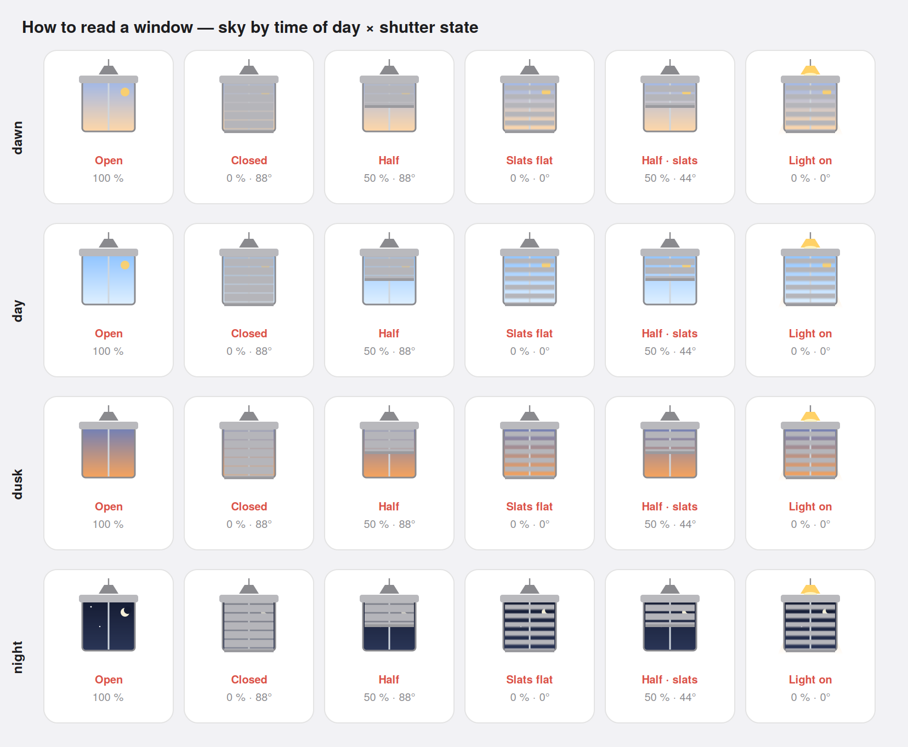

Rows: the sky at dawn, day, dusk and night (from Homey's sunrise/sunset). Columns: open, closed (88° = slats shut),
half down, closed with slats flat (0° — the sky shows through the slats), half down with slats mid-way, and a room
lamp on (pendant lit, light cone over the window).

### Roadmap — widgets under consideration

Design studies for the next widgets. Nothing here is built yet; feedback welcome in the issues.

| Candidates | Colour tints | Room thermostat gauge |
|---|---|---|
| 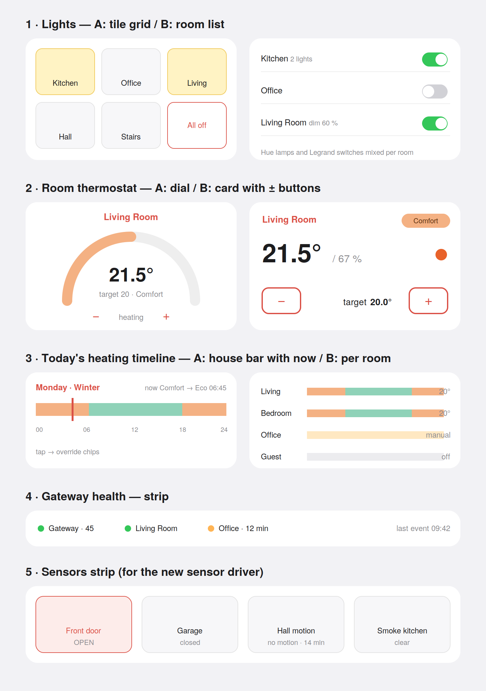 | 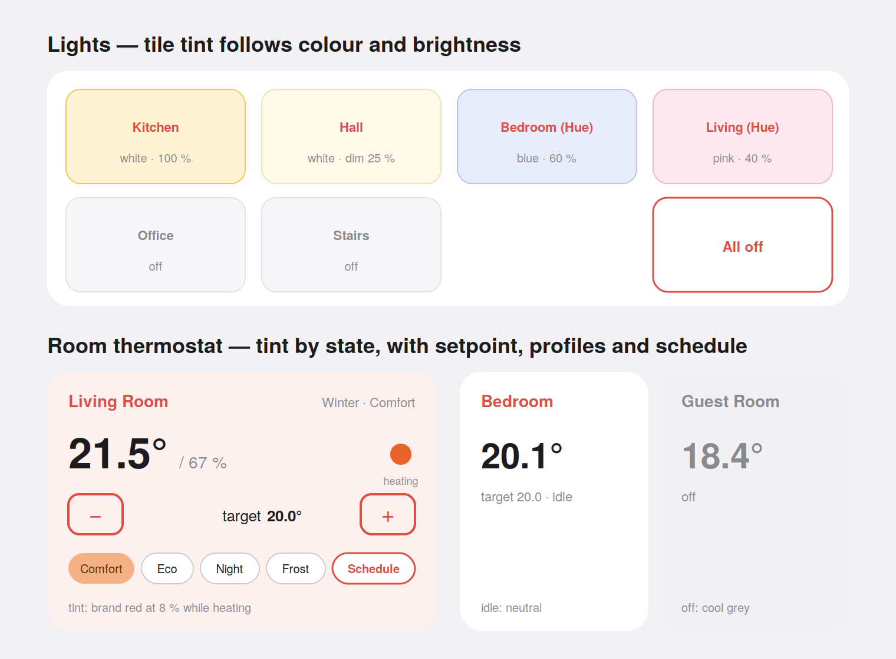 | 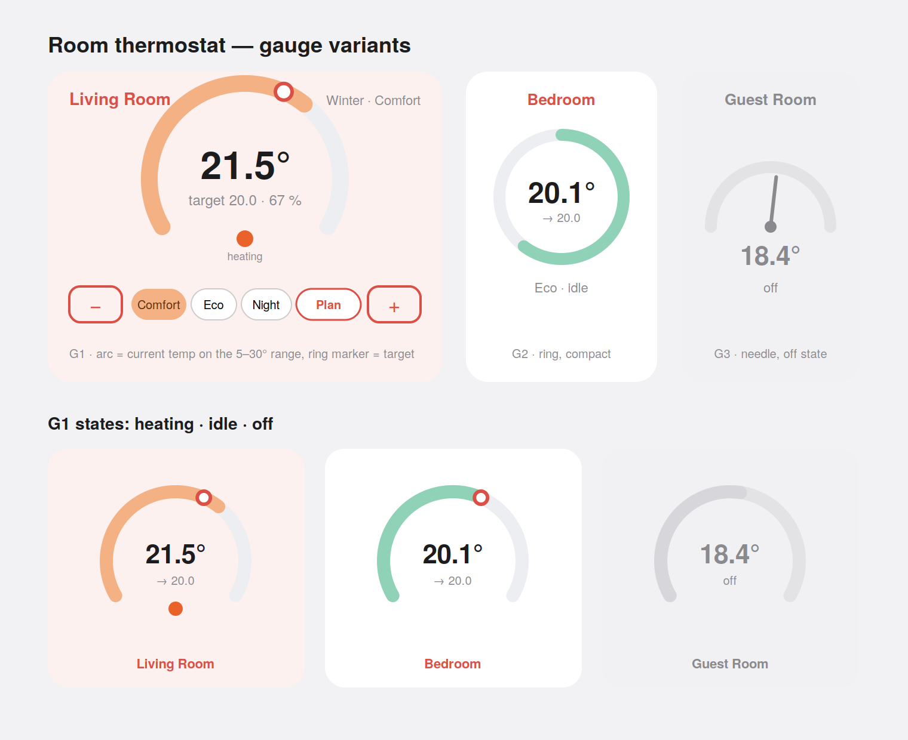 |
| **Room thermostat gauge** (redesign), **today's heating timeline**, **gateway health**, **sensors strip** | Tile backgrounds follow the bulb's colour and brightness; thermostat tint follows heating / idle / off — all faint, brand red as accent | Arc gauge over the 5–30 °C range with the target marker, − / + setpoint, per-room profile chips and a "Plan" button to rejoin the schedule |

## Heating plan

*App settings → Heating.* A house-wide weekly schedule, like the one in Home + Control but run
by Homey, so presence, calendars and windows can drive it from Flows.

- **Profiles**: Comfort, Eco and Night with a temperature per room; Away and Frost guard as
  house-wide values.
- **Plans**: several named plans (Winter, Summer…), one active; per day a list of switch points
  (time → profile), copy days, colored week bars.
- **Overrides**: put the whole house on a profile until the next switch point, for N hours or
  until cancelled — from the settings page or a Flow.
- **Per room**: turning the dial (on the wall, in Homey or in Home + Control) holds that room
  manually until the next switch point; a room can opt out of the plan entirely. The device's
  mode picker shows *Schedule*, *Manual*, *Frost guard* or *Off* accordingly.
- Setpoints are re-applied every 30 minutes, which also defeats the Smarther's own 2-hour
  manual-mode expiry. Switch the thermostats to manual mode in Home + Control so both
  schedules don't compete.
- Optional timeline notifications for profile changes and room manual changes.

## Scenes

*App settings → Scenes.* A scene is a named set of target states — shutter position and slat
angle, thermostat mode and target, and lights: any lamp on Homey (on/off, brightness, colour), a room "all off",
or a Homey mood; thermostats and air conditioners from other apps (power, mode, target, fan) — with an emoji. "Capture current" pre-fills a scene from how the house is right now. Run from
the settings page, a Flow (*Activate scene*) or the Scenes widget.

## Troubleshooting

- **"Already paired to another controller"**: remove the device from Apple Home, or reset its
  HomeKit pairing (gateway: hold the cogwheel button ~10 s and release at the first colour
  flash — *not* longer, that resets the installation). Full steps in App settings → Gateways → Help.
- **Device not found on the network**: enable mDNS reflection between VLANs on your router, or
  pair by id + IP (Gateways → Expert).
- **Log**: App settings → Log shows every event and write per device, filterable.

## Development

```bash
npm install
npm run lint       # ESLint (app JS + inline scripts): no-shadow, no-redeclare, no-undef
npm run validate   # homey app validate
homey app run
```

- `lib/HapSession.js` — endpoint pool: one encrypted HAP session per paired device, reconnect,
  `c#` watching, periodic accessory-DB diff, IPv4-only addressing.
- `lib/HapDevice.js` / `lib/HapDriver.js` — shared device/driver base (dynamic capabilities, pairing).
- `lib/Heating.js`, `lib/Scenes.js` — plan engine and scenes.
- `widgets/*` — dashboard widgets; `settings/index.html` — settings page.
- `homey-api` + permission `homey:manager:api` — resolves widget device selections.

### Dead ends (kept so nobody retries them)
- **`PairSetupWithAuth` as the first pairing method** — the Somfy TaHoma Switch ignores it entirely (40 s of silence), and the dangling attempt leaves the box reporting Busy (M2 Error 7) to the next try. Plain `PairSetup` (what aiohomekit uses) is answered instantly and pairs. Order is now plain first, with-auth as fallback. Related: the TaHoma restarts its HAP daemon after failed attempts and comes back on a NEW port — never pair against a cached advertisement (pair() refreshes mDNS first).
- **`api.devices.connect()` to cut Web API load** — a connected devices manager serves cached device objects, but Homey realtime only patches that cache on `device.update` (rename, settings), never on capability value changes; every lamp and shutter state freezes at its startup value. Live values over the manager require `makeCapabilityInstance` per device+capability. `zones.connect()` is fine (zones update via `zone.update`).

- **Stop for shutters**: Legrand exposes no HoldPosition and re-writing CurrentPosition does not
  halt travel. No stop command; the up/down state capability exists for Flows only and refuses "idle".
- **"Exclude from Energy" on lights**: only metered devices get it; `setEnergy()` tricks detach
  devices from manifest defaults. Set "Power usage when on" to 0 W instead.
- **Custom number sensors as tile status**: only custom *string* capabilities are offered in the
  status-indicator picker.
- **hap-controller's mDNS inside the app container**: unreliable; Homey's discovery service is used.
- **Homey device id from the SDK `Device`**: not exposed; the Web API lookup is the supported way.
- **Friendly names over HAP**: the gateway advertises module names only.

## Credits

Built on [hap-controller](https://github.com/WebThingsIO/hap-controller-node). Not affiliated with
Legrand, BTicino, Netatmo or Apple. Licensed under GPL-3.0 — see [LICENSE](LICENSE).
